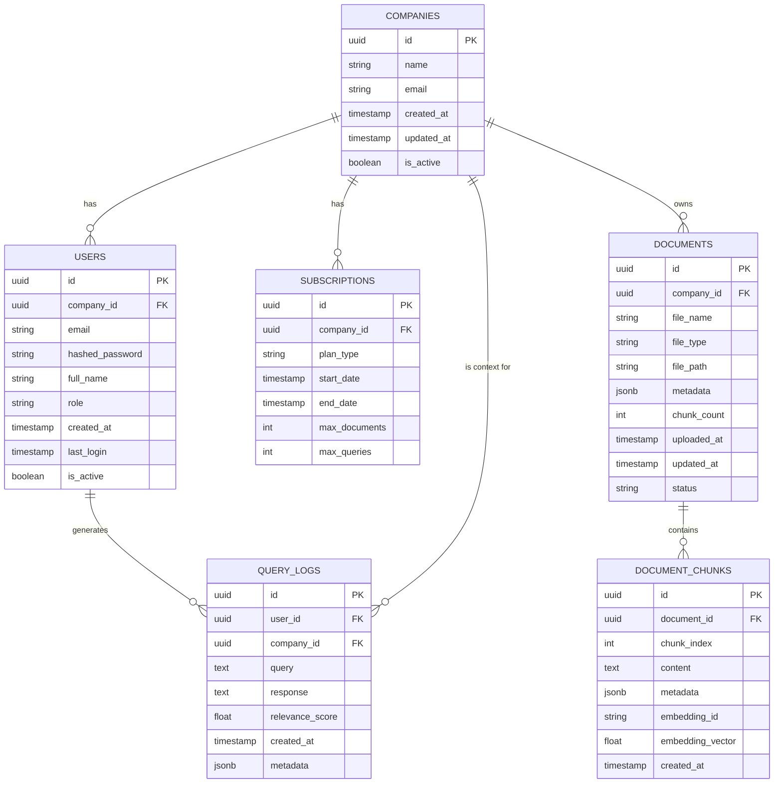

# BD Schema

# Data Base

MD PARA LLMS:

```
# Esquema de Base de Datos - SaaS B2B Multi-tenant (Supabase + Milvus)

## Tablas Principales

### COMPANIES
- `id` (UUID, PK): ID único de la empresa.
- `name` (string): Nombre.
- `email` (string): Correo de contacto.
- `created_at`, `updated_at` (timestamp): Fechas de creación y actualización.
- `is_active` (boolean): Estado de activación.

### USERS
- `id` (UUID, PK): ID único del usuario.
- `company_id` (UUID, FK → COMPANIES.id): Empresa a la que pertenece.
- `email` (string): Email del usuario.
- `hashed_password` (string): Contraseña (opcional si se usa Supabase Auth).
- `full_name` (string): Nombre completo.
- `role` (string): Rol (admin, user, etc.).
- `created_at`, `last_login` (timestamp): Fechas de registro y último acceso.
- `is_active` (boolean): Estado del usuario.

### SUBSCRIPTIONS
- `id` (UUID, PK): ID de suscripción.
- `company_id` (UUID, FK → COMPANIES.id): Empresa suscripta.
- `plan_type` (string): Tipo de plan.
- `start_date`, `end_date` (timestamp): Vigencia.
- `max_documents`, `max_queries` (int): Límites del plan.

### DOCUMENTS
- `id` (UUID, PK): ID del documento.
- `company_id` (UUID, FK → COMPANIES.id): Empresa propietaria.
- `file_name`, `file_type`, `file_path` (string): Info del archivo.
- `metadata` (jsonb): Datos adicionales (idioma, tamaño, etc.).
- `chunk_count` (int): Total de chunks generados.
- `uploaded_at`, `updated_at` (timestamp): Tiempos de carga y edición.
- `status` (string): Estado del documento.

### DOCUMENT_CHUNKS
- `id` (UUID, PK): ID del chunk.
- `document_id` (UUID, FK → DOCUMENTS.id): Documento de origen.
- `chunk_index` (int): Índice de chunk.
- `content` (text): Texto del chunk.
- `metadata` (jsonb): Info adicional (página, idioma, etc.).
- `embedding_id` (string): ID en Milvus (opcional).
- `embedding_vector` (float[]): Vector en pgvector (opcional).
- `created_at` (timestamp): Fecha de creación.

### QUERY_LOGS
- `id` (UUID, PK): ID del log.
- `user_id` (UUID, FK → USERS.id): Usuario que consultó.
- `company_id` (UUID, FK → COMPANIES.id): Empresa asociada.
- `query` (text): Consulta hecha.
- `response` (text): Respuesta generada.
- `relevance_score` (float): Score de relevancia (opcional).
- `created_at` (timestamp): Fecha/hora.
- `metadata` (jsonb): Info extra (documentos, tiempos, etc.).

## Relaciones Clave

- `COMPANIES` → 1:N → `USERS`, `DOCUMENTS`, `SUBSCRIPTIONS`, `QUERY_LOGS`
- `DOCUMENTS` → 1:N → `DOCUMENT_CHUNKS`
- `USERS` → 1:N → `QUERY_LOGS`

## Notas Especiales

- Multi-tenant: Todas las tablas principales tienen `company_id` como FK.
- Auth: Supabase Auth puede integrarse con `USERS` vía `auth_user_id`.
- Embeddings: Opcionalmente en Postgres (`embedding_vector`) o referenciado (`embedding_id`) en Milvus.

```

A continuación se presenta un **diagrama ER** consolidado que unifica toda la información de los dos esquemas anteriores y ajusta las relaciones para reflejar un modelo **SaaS B2B** multi-tenant. Se incluyen tablas para empresas, usuarios, suscripciones, documentos, chunks de documentos y logs de consultas, contemplando tanto los metadatos como la referencia (opcional) a embeddings en Milvus.

> Nota:
> 
> - Se asume que la **autenticación** se maneja con Supabase Auth (`auth.users`), y la tabla `USERS` (o `profiles`) almacena la información adicional (compañía, rol, etc.).
> - El almacenamiento de **embeddings** en Postgres es opcional. Si se usa Milvus como vector store principal, puede mantenerse una referencia (`embedding_id`) en `DOCUMENT_CHUNKS`.
> - Los campos `embedding_vector` pueden ser un `float[]` con la extensión `pgvector` o simplemente un placeholder para pruebas iniciales.

---

## Diagrama ER en Mermaid



---

## Descripción de cada Tabla

1. **COMPANIES**
    - `id`: Identificador único (UUID).
    - `name`: Nombre de la empresa.
    - `email`: Correo de contacto principal.
    - `created_at`, `updated_at`: Marcas de tiempo.
    - `is_active`: Para activar/desactivar una empresa.
2. **USERS**
    - `id`: Identificador único (UUID).
    - `company_id`: FK → `COMPANIES.id`.
    - `email`: Correo del usuario (también puede enlazar con `auth.users`).
    - `hashed_password`: Contraseña hasheada (si no se usa solamente Supabase Auth).
    - `full_name`: Nombre completo del usuario.
    - `role`: Rol dentro de la empresa (admin, user, etc.).
    - `created_at`, `last_login`: Fechas de creación y último acceso.
    - `is_active`: Para activar/desactivar al usuario.
3. **SUBSCRIPTIONS**
    - `id`: Identificador único (UUID).
    - `company_id`: FK → `COMPANIES.id`.
    - `plan_type`: Tipo de plan (free, pro, enterprise, etc.).
    - `start_date`, `end_date`: Período de vigencia de la suscripción.
    - `max_documents`, `max_queries`: Límites de uso según el plan.
4. **DOCUMENTS**
    - `id`: Identificador único (UUID).
    - `company_id`: FK → `COMPANIES.id`.
    - `file_name`: Nombre del archivo (ej. “contrato_2023.pdf”).
    - `file_type`: Tipo de archivo (pdf, docx, jpg, etc.).
    - `file_path`: Ruta o URL en el storage (Supabase Storage, S3, etc.).
    - `metadata`: Campo JSON con información adicional (tamaño, idioma, etc.).
    - `chunk_count`: Número de chunks generados tras el preprocesamiento.
    - `uploaded_at`, `updated_at`: Marcas de tiempo de subida y última actualización.
    - `status`: Estado del documento (“uploaded”, “processed”, “indexed”, etc.).
5. **DOCUMENT_CHUNKS**
    - `id`: Identificador único (UUID).
    - `document_id`: FK → `DOCUMENTS.id`.
    - `chunk_index`: Índice del chunk en el documento (0,1,2...).
    - `content`: Texto del chunk.
    - `metadata`: JSON con datos adicionales (ej. página de origen, idioma detectado, etc.).
    - `embedding_id`: (Opcional) Identificador en la base vectorial (Milvus) para buscar este chunk.
    - `embedding_vector`: (Opcional) Vector de embeddings en Postgres (si se usa `pgvector`) o un simple float de ejemplo.
    - `created_at`: Fecha de creación del chunk.
6. **QUERY_LOGS**
    - `id`: Identificador único (UUID).
    - `user_id`: FK → `USERS.id` (quién hizo la consulta).
    - `company_id`: FK → `COMPANIES.id` (para aislar consultas por empresa).
    - `query`: Texto de la consulta en lenguaje natural.
    - `response`: Respuesta generada (puede provenir del LLM).
    - `relevance_score`: Puntuación de relevancia, si aplica.
    - `created_at`: Fecha/hora de la consulta.
    - `metadata`: Campo JSON para almacenar información extra (ej. IDs de documentos utilizados, tiempos de respuesta, etc.).

---

## Consideraciones Adicionales

1. **Autenticación y Roles**
    - Si usas Supabase Auth, cada registro de `USERS` puede vincularse a `auth.users` mediante un campo `auth_user_id`.
    - El `role` en `USERS` ayuda a la autorización interna (admin, user, etc.).
2. **Separación Multi-Tenant**
    - Todas las tablas principales (USERS, DOCUMENTS, QUERY_LOGS, etc.) tienen un `company_id` para garantizar el aislamiento.
    - Los endpoints de la API deben filtrar por `company_id` en base al JWT (claim) o al `auth_user_id`.
3. **Embeddings y Milvus**
    - Idealmente, el texto de cada chunk y sus embeddings se almacenan en Milvus.
    - En la tabla `DOCUMENT_CHUNKS`, `embedding_id` y/o `embedding_vector` son opcionales. Se pueden usar para depurar o si deseas tener un fallback en Postgres.
4. **Suscripciones**
    - El esquema admite varios registros de suscripción por empresa si se requiere (historial de planes).
    - Si solo necesitas una suscripción activa por compañía, puedes manejarlo con un check en `is_active` o con un `status` (por ejemplo, “active”, “expired”).
5. **Extensibilidad**
    - Puedes añadir más campos en `metadata` según las necesidades de OCR (p. ej. idioma, páginas, confidencialidad).
    - Si se requiere versionado de documentos, podrías incluir una tabla `DOCUMENT_VERSIONS`.

---

### Conclusión

Este **modelo de datos** en Supabase cubre de forma completa los requerimientos principales de un **MVP multi-tenant** para RAG (Retrieval-Augmented Generation), permitiendo:

- **Gestionar empresas** y **sus usuarios** con roles.
- **Subir documentos** con metadatos y dividirlos en chunks.
- **Almacenar logs de consultas** y sus respuestas.
- **Controlar suscripciones** y planes de cada empresa.

Al mismo tiempo, se integra con **Milvus** (u otro Vector Store) para la indexación y búsqueda por similitud, manteniendo en la base relacional solo la referencia necesaria (`embedding_id`) o, si se desea, un campo `embedding_vector` para pruebas o auditoría. Este diseño es lo **suficientemente sencillo** para un MVP, pero **escalable** y fácil de mantener en producción.